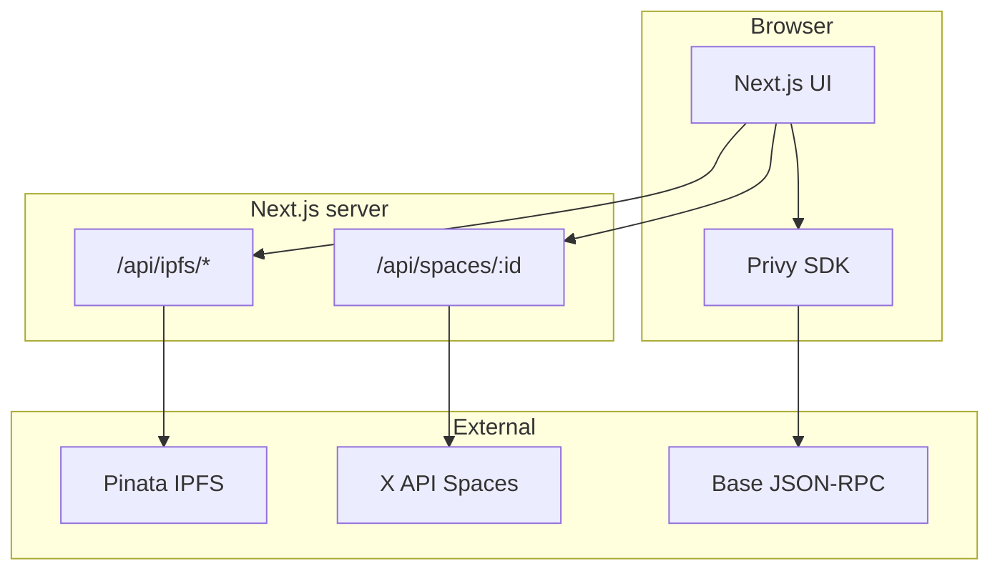

# Treegens X Spaces

**Repository:** [github.com/Laszlo23/treegens-x-spaces](https://github.com/Laszlo23/treegens-x-spaces)

**Treegens X Spaces** is a Next.js mini-app that turns **X (Twitter) Spaces** into collectible **Voice Seeds** — ERC-721 NFTs on **Base** with audio and metadata on **IPFS**. Users join a Space, complete a participation window, capture a short voice moment, mint on-chain, and share to **X** and **Farcaster**.

Designed as a **forest-themed** community experience: bottom navigation (Profile, Space, Leaderboard, Tasks), **Privy** login (Farcaster + wallets), and optional **X API v2** integration for real Space metadata when credentials are configured.

---

## Features

| Area | What it does |
|------|----------------|
| **Space** | Paste an X Space URL; loads title, host, and speakers via **X API v2** (if `X_API_BEARER_TOKEN` / `TWITTER_BEARER_TOKEN` is set) or **deterministic demo data** otherwise. |
| **Participation** | Tab-visible timer toward a **15-minute** gate; unlocks minting for that Space session (persisted per Space id). |
| **Tasks** | Generates demo audio, uploads **WAV + JSON** to IPFS via **Pinata** (server routes), mints **`mintSeed`** on the **VoiceSeed** contract. |
| **Profile** | Farcaster / wallet identity plus a **gallery** of indexed Voice Seeds (local storage + chain events). |
| **Leaderboard** | Ranks **speakers** by how often they appear in minted metadata. |
| **Share** | Per-token share page with **Open Graph** image and intent links for X and Farcaster. |

---

## Stack

- **Framework:** [Next.js 14](https://nextjs.org/) (App Router), TypeScript, Tailwind CSS, Framer Motion  
- **Auth & wallets:** [Privy](https://privy.io/) — Farcaster, external wallets, embedded wallets  
- **Chain:** [Base](https://base.org/) — Sepolia (84532) or mainnet (8453), toggled by env  
- **Contracts:** [Hardhat](https://hardhat.org/), Solidity 0.8.26, OpenZeppelin ERC721 URI storage  
- **IPFS:** [Pinata](https://pinata.cloud/) (JWT server-side only)  
- **X:** Twitter API v2 Spaces lookup (bearer token server-side)



---

## Prerequisites

- **Node.js 18+** and npm  
- **Privy** app id ([dashboard](https://dashboard.privy.io)) — enable Farcaster + Ethereum, add **Base Sepolia** and/or **Base mainnet** to allowed chains  
- **Pinata** JWT with pinning permissions (for real IPFS uploads)  
- **Deployer wallet** with ETH on **Base Sepolia** or **Base** for contract deploy  
- *(Optional)* **X API** bearer token with **Spaces** access for live Space lookup  

---

## Quick start

```bash
git clone https://github.com/Laszlo23/treegens-x-spaces.git
cd treegens-x-spaces
cp .env.example .env
# Edit .env — see Environment variables below (never commit .env)
npm install
npm run dev
```

Open [http://localhost:3000](http://localhost:3000).

```bash
# Production build
npm run build
npm start
```

---

## Environment variables

Copy [`.env.example`](.env.example) to `.env`. **Never commit `.env`.**

| Variable | Required | Description |
|----------|----------|-------------|
| `NEXT_PUBLIC_PRIVY_APP_ID` | Yes* | Privy application id. |
| `NEXT_PUBLIC_VOICE_SEED_CONTRACT_ADDRESS` | For mint / gallery | Deployed `VoiceSeed` contract (0x…). |
| `NEXT_PUBLIC_USE_BASE_MAINNET` | No | `true` = Base mainnet (8453); `false` or unset = Base Sepolia (84532). |
| `NEXT_PUBLIC_BASE_SEPOLIA_RPC` | No | Sepolia RPC override. |
| `NEXT_PUBLIC_BASE_MAINNET_RPC` | No | Mainnet RPC override. |
| `NEXT_PUBLIC_APP_URL` | For OG / share | Canonical site URL (e.g. `https://yourdomain.com`). |
| `PINATA_JWT` | For IPFS | Server-only Pinata JWT (no `NEXT_PUBLIC_` prefix). |
| `X_API_BEARER_TOKEN` / `TWITTER_BEARER_TOKEN` / `TWITTER_API_BEARER_TOKEN` | No | Any **one** of these for X Spaces API (first match wins). |
| `NEXT_PUBLIC_IPFS_GATEWAY` | No | Default `https://gateway.pinata.cloud/ipfs/` |
| `NEXT_PUBLIC_VOICE_SEED_FROM_BLOCK` | No | Start block for event scans (performance). |
| `DEPLOYER_PRIVATE_KEY` | Deploy only | Hardhat deployer (local / CI only). |
| `BASE_SEPOLIA_RPC_URL` | Deploy Sepolia | RPC for `deploy:base-sepolia`. |
| `BASE_MAINNET_RPC_URL` | Deploy mainnet | RPC for `deploy:base`. |

\* Without Privy id, the app shows a configuration banner; minting uses Privy when configured.

---

## Smart contract

Compile and deploy **`VoiceSeed`** (`contracts/VoiceSeed.sol`):

```bash
npm run compile
# Base Sepolia (testnet)
npm run deploy:base-sepolia
# Base mainnet (real ETH)
npm run deploy:base
```

Set `NEXT_PUBLIC_VOICE_SEED_CONTRACT_ADDRESS` from the deploy output. For mainnet app mode, set `NEXT_PUBLIC_USE_BASE_MAINNET=true` and use a mainnet RPC.

ABI for the app lives at [`src/lib/abis/VoiceSeed.json`](src/lib/abis/VoiceSeed.json) (update after contract changes via `npx hardhat compile` and copy artifact if needed).

---

## IPFS (Pinata)

- Routes: [`src/app/api/ipfs/upload/route.ts`](src/app/api/ipfs/upload/route.ts) (audio), [`src/app/api/ipfs/json/route.ts`](src/app/api/ipfs/json/route.ts) (metadata).  
- Smoke test (dev server running): `npm run smoke:ipfs`  
- Mirror **`PINATA_JWT`** in Vercel/host **server** env — never expose as `NEXT_PUBLIC_*`.

---

## X (Twitter) Spaces API

- Server route: [`src/app/api/spaces/[id]/route.ts`](src/app/api/spaces/[id]/route.ts)  
- Mapping: [`src/lib/twitter-spaces.ts`](src/lib/twitter-spaces.ts)  
- Without a bearer token, the API returns **demo metadata** (same shape as live).  
- Reaction emoji breakdowns are **not** provided by X; the UI uses illustrative / scaled estimates when using live API data.

---

## Scripts

| Script | Purpose |
|--------|---------|
| `npm run dev` | Development server |
| `npm run build` / `npm start` | Production |
| `npm run lint` | ESLint |
| `npm run compile` | Hardhat compile |
| `npm run deploy:base-sepolia` | Deploy to Base Sepolia |
| `npm run deploy:base` | Deploy to Base mainnet |
| `npm run smoke:ipfs` | POST test JSON to Pinata via `/api/ipfs/json` |

---

## Project structure (high level)

```
contracts/          # VoiceSeed.sol
scripts/            # deploy.ts, smoke-ipfs.sh
src/app/            # App Router pages, API routes, OG image
src/components/     # UI: tabs, capture, gallery, navbar, footer dock
src/config/         # Chain + site helpers
src/lib/            # Contract, IPFS, spaces, metadata, indexing
public/             # Static assets (e.g. logo)
```

---

## Deployment (e.g. Vercel)

1. Connect the GitHub repo.  
2. Set **all** `NEXT_PUBLIC_*` and server secrets (`PINATA_JWT`, X bearer token, etc.) in the project **Environment Variables**.  
3. Set `NEXT_PUBLIC_APP_URL` to the production URL.  
4. Confirm Privy allows your production origin and Base chain(s).

---

## Security notes

- Do **not** commit `.env` or private keys.  
- **Pinata** and **X** tokens are **server-only**.  
- Review [Privy](https://docs.privy.io/) and [Pinata](https://docs.pinata.cloud/) docs for key rotation and scopes.

---

## License

[MIT](LICENSE) — contract sources use SPDX `MIT` in-file ([`contracts/VoiceSeed.sol`](contracts/VoiceSeed.sol)).

---

## Name

This repository and product are referred to as **Treegens X Spaces** — collectible voice moments from X Spaces, rooted in the Treegens / forest DAO theme.
